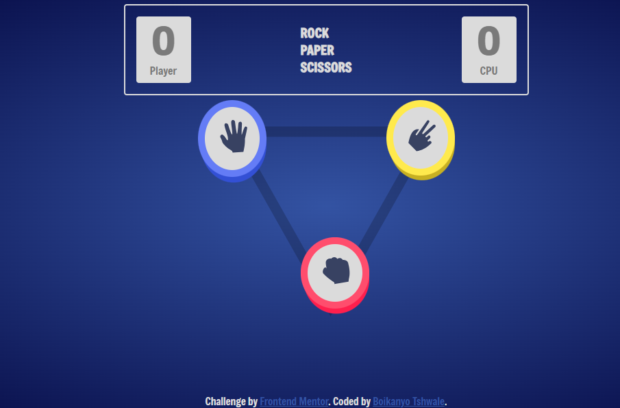
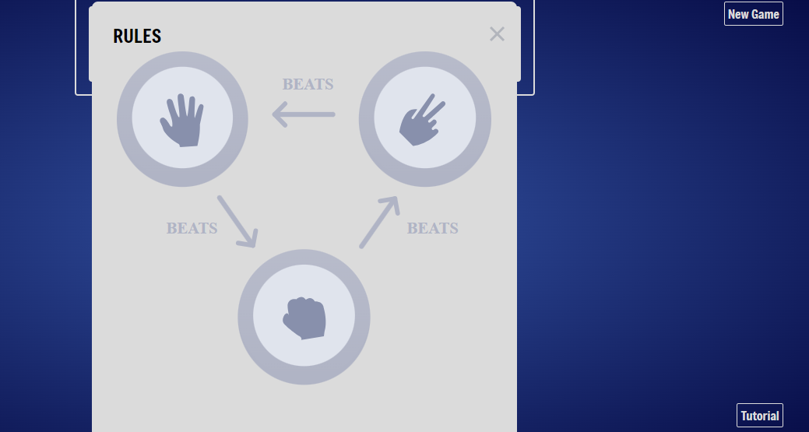
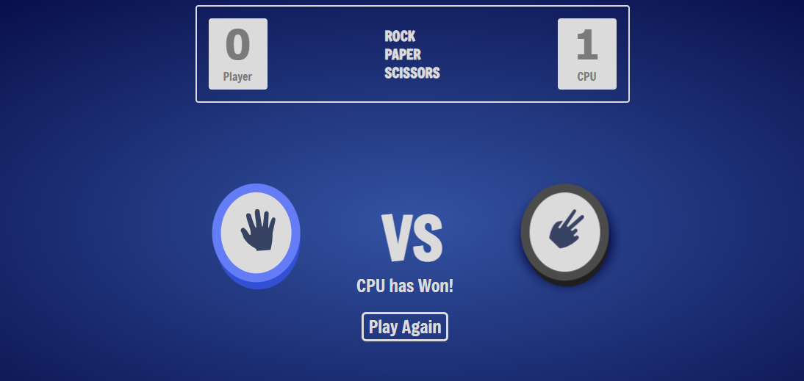

# Rock, Paper, Scissors Project

## Project Description

This project is a rock paper scissors web game, user clicks on one of the available hand signs(rock, paper, scissors) and battles the cpu in an unlimited amount of rounds. The CPU will pull up a random hand sign and if guessed correctly the user will receive a point and if the cpu wins vice versa. Games can be resumed even through a refresh, a New Game can commence after clicking the "New Game" button, A tutorial can be activated through the "Tutorial" button.

### Languages Used are

> HTML  
> CSS  
> Javascript
>
> > JQuery

---

### How to use

download file from Github and open/start a live server this can be done by using/downloading a "live server" extension through VS Code.  
Or you could use this link to use it: [Rock Paper Scissors Game](https://bk-up.github.io/Rock_Paper_Scissors/)

##### User choses between rock, paper, scissors:

> 

##### User can view tutorial through "Tutorial" button:

> 

##### Battles occur as follows:

> 
